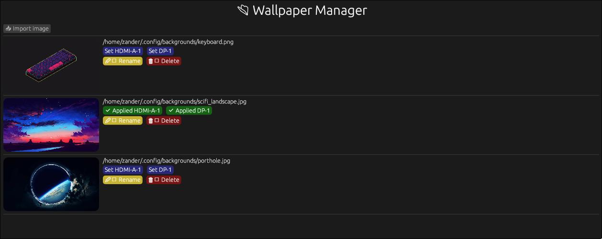

<p align="center">
  
</p>

# Wallpaper Manager

A wallpaper manager for Hyprland with support for multiple monitors, graphical user interface (GUI), and automatic wallpaper restoration after reboot.

---

<p align="center">
  
</p>

## Features

- Graphical interface for selecting images
- Support for multiple monitors via `hyprctl`
- Integration with `swww`
- Saving the last selected wallpaper
- `apply` subcommand to automatically reapply on reboot

---

## Requirements

- Wayland session (Hyprland, Sway, etc.)
- [`swww`](https://github.com/LabDump/swww)
- `hyprctl` (Hyprland installed)
- System libraries:
  - `wayland`, `libxkbcommon`, `libX11`, `libGL`, `vulkan-loader`

---

## Installation

### Via Cargo

```bash
cargo install wallpaper-manager
```

> Ensure you have the Wayland libraries and `swww` installed on your system.

---

## Usage

### Graphical Interface

```bash
wallpaper-manager gui
```

> Browse images in `~/.config/backgrounds` and apply with a click.

### Apply Last Saved Wallpaper

```bash
wallpaper-manager apply
```

---

## Auto-start on Login

Add to your `~/.config/hypr/hyprland.conf`:

```ini
exec-once = swww-daemon
exec-once = wallpaper-manager apply
```

> This ensures the `swww` daemon starts and the wallpaper is restored on login.

---

## File Organization

By default, the program looks for images in:

```
~/.config/backgrounds
```

Place your wallpapers in this folder. For example:

- `~/.config/backgrounds/meadow.jpg`
- `~/.config/backgrounds/dark-moon.png`

---

## Contributing

Contributions are welcome!

- Report issues
- Submit pull requests
- Suggest improvements

---

## License

MIT © 2025 - Z4nder
